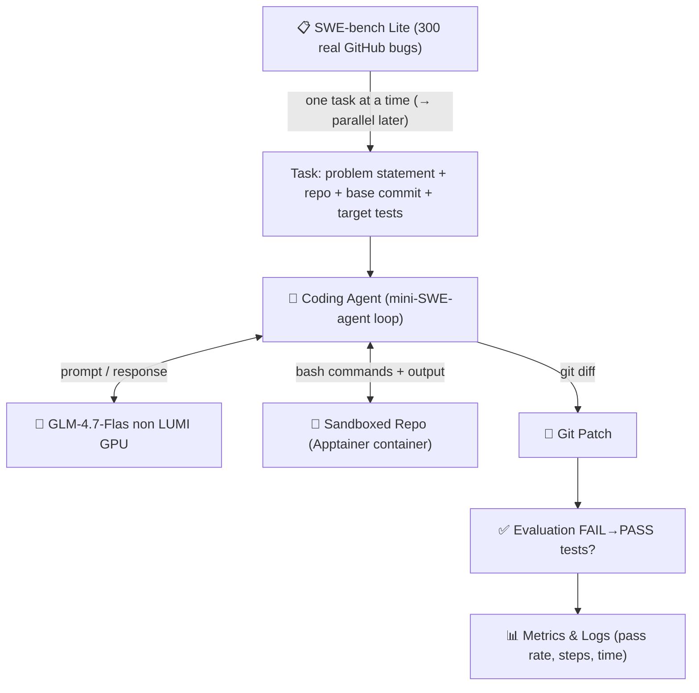
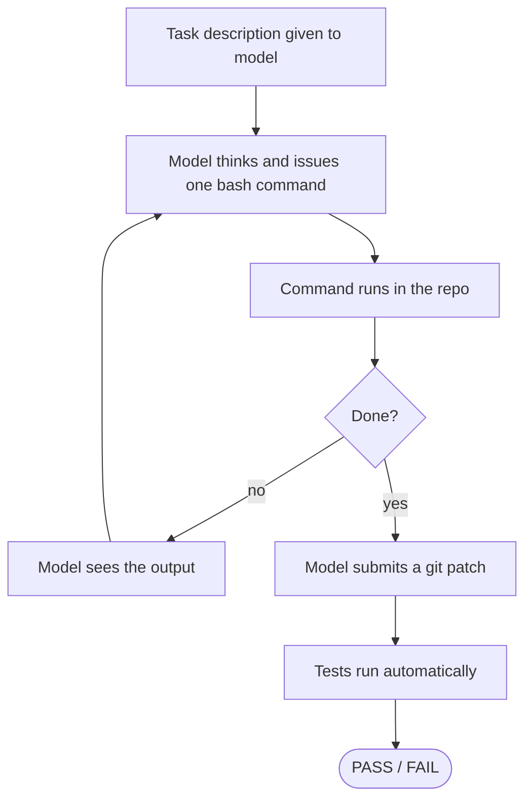
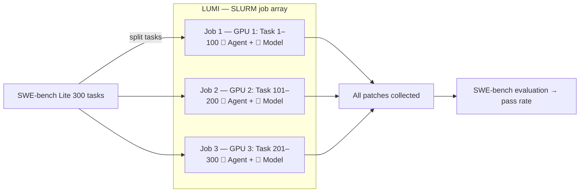

# Scaling AI Coding Agents on LUMI

## 1. Research Question

**Primary question:**
How does scaling AI coding agents on a supercomputer (LUMI) affect performance, efficiency, and solution quality when evaluated using standardized software engineering benchmarks (e.g. SWE-bench)?

**Sub-questions:**

* What does *scaling* mean in practice for AI coding agents (models, agents, prompts, parallelism)?
* Which scaling axes provide meaningful gains (number of agents, resource allocation)?
* What bottlenecks emerge when moving from single-agent to multi-agent execution?

---

## 2. Scope: What "Scaling" Means
There are many possible dimensions for scaling:

* **Model execution**
  * Running large language models locally on LUMI GPUs
  * Comparing single-GPU vs multi-GPU inference (future)

* **Agent parallelism**
  * Running many independent coding agents in parallel
  * Each agent attempts to solve the same or different benchmark tasks

* **Evaluation throughput**
  * High-volume generation of patches
  * Batch evaluation via SWE-bench

Out of scope for this project:

* Training or fine-tuning models
* Reinforcement learning
* Human-in-the-loop evaluation

---

## 3. High-Level Architecture

### Goal pipeline

### Agent loop

Key design principles:

* The **model** is a black-box text generator running on LUMI GPUs
* The **agent** frames prompts, parses responses, and executes shell commands
* The **benchmark** evaluates correctness purely via test outcomes — no human judgment

---

## 4. Plan and Progress

### ✅ Done

| Experiment | What | Result |
|---|---|---|
| `lumi_glm_test_2` | One-shot diff generation, GLM-4.7-Flash on LUMI GPU | Working, variable output quality |
| `lumi_glm_test_2` (API) | Same via HuggingFace inference API | Working |
| `lumi_glm_test_3` | Interactive agent loop (mini-SWE-agent style), API | PASS in 10 steps, 19s |
| `lumi_glm_test_3` | Same, local GPU on LUMI | PASS in 6 steps, 520s + 520s model load |
| SWE-bench Lite | Dataset explored, task format understood, sample file created | 300 real tasks ready |
| `lumi_glm_test_4` | Agent on real SWE-bench tasks, API mode, 3 tasks | Pipeline fully working; 1/2 evaluable tasks solved* — see `experiments/lumi_glm_test_4/README.md` |

*astropy-14365 solved correctly in 4/4 runs (re.IGNORECASE fix), but unevaluable due to SWE-bench quirk. astropy-12907 not solved (hit 20-step limit). django-10914 incomplete (API credits ran out).

**Key findings from experiment 4:**
- Sandbox approach solved nested Singularity: extract SIF to `/tmp` (local NVMe) at job start — minutes vs 1+ hour on Lustre
- Agent consistently finds correct fixes for straightforward bugs (astropy-14365: 4/4)
- GLM-4.7-Flash (MoE) crashes on LUMI's AMD MI300X: `torch._grouped_mm` not supported on ROCm
- HF free-tier API: ~10s/step (rate-limited), credits exhausted after ~2.5 tasks

### In Progress / Blocked

* **ROCm grouped GEMM** — GLM-4.7-Flash MoE inference crashes on AMD MI300X (`torch._grouped_mm` not supported). Options: monkey-patch fallback, switch to non-MoE model, or wait for ROCm support.
* **API credits** — HF free tier exhausted. Need paid credits or alternative provider.

### Next Steps

1. **Fix GPU inference** — resolve ROCm grouped GEMM issue to enable local model runs
2. **Run full baseline** — 3 tasks with both API and GPU, compare pass rate and speed
3. **Parallelism** — run multiple tasks concurrently via SLURM job arrays (the core scaling experiment)
4. **More tasks** — scale to 10–30 tasks for statistically meaningful pass rate

---

## 5. Scaling Strategy

The 300 SWE-bench tasks are **independent** — so scaling means running many agents in parallel, each solving a different task on its own GPU. SLURM job arrays are the natural fit.

**What we are studying:** How does throughput (tasks solved per hour) change as we add more parallel jobs? Where do diminishing returns appear — GPU utilization, I/O, model loading overhead?

Each job loads the model once (~520s on dev-g) and then processes its batch of tasks sequentially, so more jobs = more GPUs used = faster total wall time.

---

## 7. Optionals

* Multi-agent sampling per task (run N agents, take best patch)

---

## 8. Current Blockers

**Apptainer / environment setup on LUMI**

SWE-bench tasks each require a specific Python environment and repo state. The original benchmark uses per-task Docker images (`swebench/sweb.eval.x86_64.<instance_id>`), but LUMI does not support Docker.

Planned approach:
- Pull a single base image: `singularity pull docker://swebench/sweb.base.x86_64`
- Clone the task repo at `base_commit` into a bind-mounted directory
- Run agent commands via: `singularity exec --bind <repo>:/testbed <image.sif> bash -c "cd /testbed && <cmd>"`

This replaces the bare `subprocess` call in `test_glm_agent.py:run_command()`.

---

## 9. Guiding Principles
* Document decisions and dead ends
* Aim for simple but working pipelines

---

*This document is expected to evolve continuously as the project progresses.*
