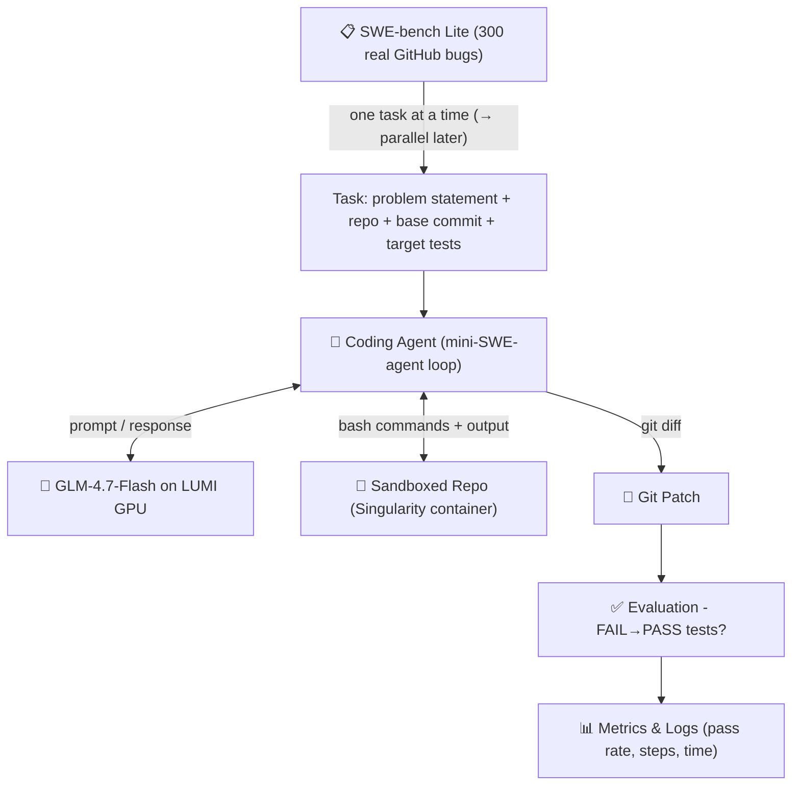
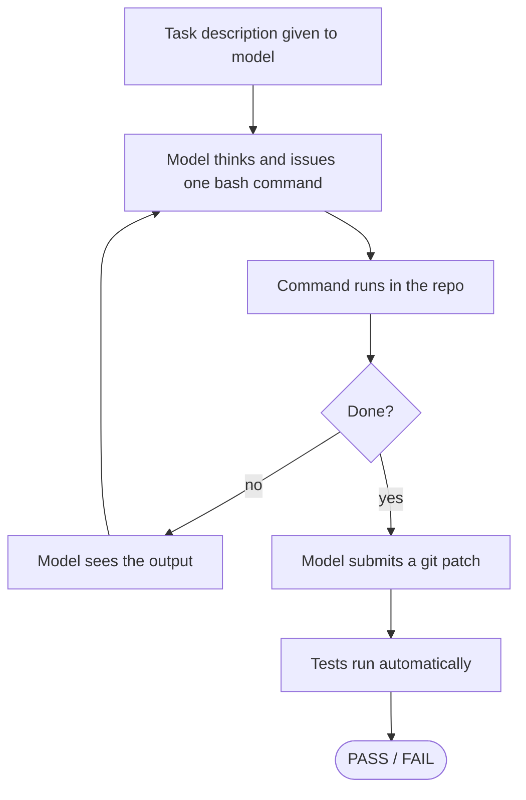
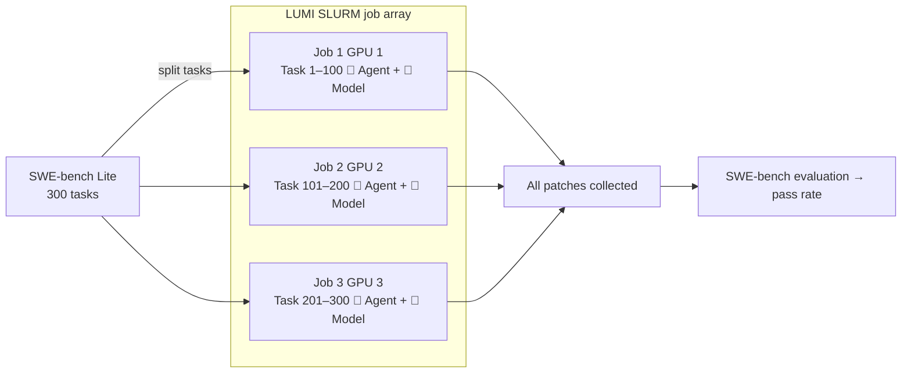

# Scaling AI Coding Agents on LUMI

*Jens Stockman - Research Project Report - 2026*

---
This report documents an end-to-end investigation into running AI coding agents on the LUMI
supercomputer, with the goal of understanding what "scaling" means in practice for autonomous
software engineering. 
---

## 1. Introduction

### 1.1 Research Question

**Primary question:**
How does scaling AI coding agents on a supercomputer affect performance, efficiency, and solution
quality when evaluated using standardised software engineering benchmarks?

**Sub-questions:**

- What does *scaling* mean in practice for AI coding agents?
- Which scaling axes provide meaningful gains (number of agents, resource allocation)?
- What bottlenecks emerge when moving from single-agent to multi-agent execution?

### 1.2 What "Scaling" Means Here

The word "scaling" is intentionally broad. This project starts by pinning down what it means in
the specific context of coding agents on a supercomputer. Several axes are possible:

- **Model size**: running larger or smaller language models
- **Agent parallelism**: running many independent agents simultaneously on different tasks
- **Evaluation throughput**: how many tasks can be solved per wall-clock hour

This project focuses primarily on **agent parallelism**: running multiple independent agents in
parallel via SLURM job arrays, each solving a different benchmark task on its own GPU. The 300
tasks in SWE-bench Lite are fully independent, making this a natural fit for supercomputer
job scheduling.

Out of scope: training, fine-tuning, reinforcement learning, and human-in-the-loop evaluation.

### 1.3 Why GLM-4.7-Flash?

Model choice was driven by several constraints:

1. **Open weights**: the model must be downloadable and run locally (no API required for GPU runs)
2. **Instruction following**: the agent loop requires the model to reliably produce structured
   outputs (exactly one bash command per response)
3. **Code capability**: the model must be able to read, reason about, and edit source code
4. **Size vs. speed**: with ~520s model load time on LUMI dev-g, inference speed matters;
   a 9B model is a reasonable starting point
5. **Recency**: GLM-4.7-Flash (`zai-org/GLM-4.7-Flash`) was released in early 2025,
   specifically optimised for instruction following and tool use

GLM-4.7-Flash is a **Mixture-of-Experts (MoE)** model with 9B activated parameters, developed by
Zhipu AI. It benchmarks well on code tasks relative to its inference cost. It is also supported
by the HuggingFace Inference API (free tier), which allowed early experiments to run without GPU
access.

One important caveat discovered during the project: GLM-4.7-Flash's MoE routing uses a fused
kernel (`torch._grouped_mm`) that is not implemented on AMD ROCm. This required a targeted
monkey-patch to LUMI's Python environment and was a significant blocker (see Section 5.1).

### 1.4 Why mini-SWE-agent?

Several agentic coding frameworks exist (SWE-agent, AutoCodeRover, Agentless, etc.). This project
chose to implement a **minimal custom agent loop** modelled on
[mini-SWE-agent](https://mini-swe-agent.com) for the following reasons:

- **Transparency**: a hand-written loop makes every component explicit and inspectable. There is
  no hidden prompt engineering, retrying, or state management that could confound timing measurements.
- **Portability**: a single Python file with no heavy framework dependencies is far easier to run
  inside a Singularity container on LUMI.
- **Auditability**: for research purposes, being able to read every prompt and every model response
  in a plain log file is more valuable than a polished product.
- **Simplicity first**: the goal is to understand infrastructure and scaling, not to maximise
  pass rate. A simple agent is sufficient to validate the pipeline.

The agent loop is a standard **observe → think → act** cycle:
1. The task description is placed in the system and user prompt.
2. The model generates a single bash command.
3. The command is executed in the task repository (or sandbox).
4. The output is appended to the conversation history.
5. Steps 2–4 repeat for up to N steps, after which the model submits a `git diff` patch.

### 1.5 Why SWE-bench?

[SWE-bench Lite](https://github.com/SWE-bench/SWE-bench) is the de facto standard benchmark for
evaluating AI coding agents on real-world software engineering tasks. It provides 300 real GitHub
issues from popular Python projects (astropy, Django, sympy, scikit-learn, etc.), each with a
problem statement, a repository at the buggy commit, and automated FAIL→PASS tests. Evaluation
is objective: either the tests pass after applying the patch, or they do not. Using a published
benchmark rather than custom tasks makes results comparable and citable.

---

## 2. System Architecture

### 2.1 Goal Pipeline

The overall pipeline takes a benchmark task and produces a pass/fail verdict:



### 2.2 Agent Loop



Key design principles:

- The **model** is a black-box text generator, it sees only the conversation history
- The **agent** frames prompts, parses responses, and runs shell commands
- The **benchmark** evaluates correctness purely via test outcomes, no human judgment

### 2.3 Scaling Strategy

The 300 SWE-bench tasks are fully independent, so scaling means running many agents in
parallel, each solving a different task on its own GPU node via a SLURM job array:



Each job loads the model once (~520s on `dev-g`) then processes its assigned tasks sequentially.
More parallel jobs = more GPUs used = lower total wall time. The key research question is: where
do diminishing returns appear, GPU utilisation, Lustre I/O, model loading overhead?

---

## 3. Experiments

### Experiment 1: First GPU Inference on LUMI (`lumi_glm_test`)

**Goal:** Prove that a large language model can run on a LUMI GPU node at all.

A minimal script loaded GLM-4.7-Flash from the HuggingFace cache, ran a simple coding prompt,
and printed the output as a SLURM job on the `standard-g` partition with one AMD MI300X GPU.

**What we learned:** GLM-4.7-Flash runs on LUMI's AMD GPUs via the CSC PyTorch Singularity
module (PyTorch with ROCm). The basic LUMI + model + inference chain works. One operational
detail that all later experiments had to account for: LUMI modules must be loaded at the start
of every session, and they do not persist across SSH sessions or compute nodes.

---

### Experiment 2: One-Shot Diff Generation (`lumi_glm_test_2`)

**Goal:** Move from a toy prompt to something closer to a real coding task: give the model a
bug description and ask it to produce a git diff in a single inference call.

Starting with one-shot generation (rather than jumping straight to an agent loop) was a
deliberate choice: one inference call, one output, no state management. This made it easy to
validate the prompt format and output parsing before introducing multi-turn complexity.

Both GPU and API modes produced plausible-looking diffs. Quality was variable though: the model
sometimes generated syntactically valid diffs that did not actually fix the bug, or patches
that failed to apply cleanly. The core problem is that the model has no way to inspect the
codebase: it is guessing the fix from the problem description alone.

**What we learned:** One-shot patching is a reasonable baseline but not a reliable strategy for
real bugs. The model needs to explore the codebase, run tests, and iterate. This motivated the
move to an interactive agent loop.

---

### Experiment 3: Interactive Agent Loop, Toy Task (`lumi_glm_test_3`)

**Goal:** Implement the full mini-SWE-agent loop and validate it end-to-end on a controlled task.

Before spending GPU hours on real benchmark tasks, the agent loop itself needed to be verified:
does the model reliably produce parseable bash commands? Is output correctly fed back into the
conversation? Does the loop terminate cleanly? A toy task (fixing a buggy Fibonacci
implementation with a known correct answer) provided a clear pass/fail check without ambiguity.

The agent solved the task in both API and local GPU modes. Via the HuggingFace API the fix was
found in 10 steps (~19s total). On the LUMI GPU, the same fix was found in 6 steps, but each
inference step took ~87s, giving ~520s of inference on top of ~520s of model loading.

**What we learned:** The agent loop works end-to-end. The ~520s model load time on LUMI is a
significant but fixed, one-time cost per session. This strongly favours batching many tasks
into a single GPU job: load once, solve many tasks sequentially.

---

### Experiment 4: Agent on Real SWE-bench Tasks (`lumi_glm_test_4`)

**Goal:** Run the agent on real tasks from SWE-bench Lite and measure pass rate.

**Why SWE-bench at this point?** With a working agent loop (Experiment 3), the next step is to
validate it against a real, citable benchmark. SWE-bench Lite provides the necessary evaluation
infrastructure: per-task Docker/Singularity images with the correct Python environments, and
automated FAIL→PASS test evaluation.

#### Infrastructure Challenge: Nested Singularity

Running on LUMI requires two nested container environments: the **LAIF container** (providing
ROCm + PyTorch + the LLM) and a **per-task SWE-bench container** (providing the correct Python
environment for the buggy repository). LUMI does not support running `singularity exec` inside
another `singularity exec`. The SUID bit is stripped inside containers and FUSE is unavailable.

The solution was to extract SIF images to the compute node's local NVMe SSD (`/tmp`) *before*
entering LAIF. Extraction to Lustre (`/scratch`) is not viable: a full SIF sandbox unpacks into
millions of small files (a complete Ubuntu OS + conda environment), and Lustre's high small-file
latency makes this take over an hour per task. The local NVMe SSD brings this down to minutes.
With images extracted, the agent could invoke commands directly against the extracted directory
without any nested container call.

#### ROCm Grouped GEMM Crash

The first GPU run crashed on every task immediately after model load:
`RuntimeError: grouped gemm is not supported on ROCM`. GLM-4.7-Flash's MoE routing calls
`torch._grouped_mm`, a fused kernel that exists in AMD ROCm PyTorch builds but is not
implemented. The fix was a one-line patch to `transformers/integrations/moe.py`: skip the fused
path when `torch.version.hip` is set (the ROCm indicator), falling through to an existing
loop-based fallback. After this patch, GPU inference worked correctly.

#### Findings

Three SWE-bench Lite tasks were run in API mode (astropy×2, django×1). The agent found the
correct fix for the straightforward task (astropy-14365: `re.IGNORECASE` added to a regex) in
every single run across four separate sessions, yet the benchmark reported FAIL every time.
Investigation revealed the cause: the FAIL_TO_PASS tests for that task are added in the *gold
commit itself* and do not exist at the base commit. The harness cannot run tests that don't
exist yet, so it always fails regardless of patch correctness. The harder task (astropy-12907,
separability matrix in compound models) hit the 20-step limit without converging, as it requires
understanding deeper architectural relationships than a simple flag change.

**What we learned:**
- The full pipeline (LAIF + SWE-bench sandbox + agent + evaluation) works end-to-end on LUMI.
- The agent reliably solves clear, localised bugs. Harder tasks need more steps or a stronger model.
- Automated pass rate can undercount correct solutions due to SWE-bench evaluation quirks.
- HF free-tier API credits run out quickly (~2.5 tasks); a paid or self-hosted inference
  endpoint is needed for any meaningful scale.

---

### Experiment 5: Pipeline Timing on QuixBugs (`lumi_glm_test_5`)

**Goal:** Measure the time and resource consumption of each individual phase of the agent
pipeline, using the local GPU model on LUMI.

#### Why Not SWE-bench for Timing?

After the successes of Experiment 4, the natural next step seemed to be running the timing
experiment on SWE-bench tasks with the local GPU. This turned out to be impossible due to a
fundamental constraint.

The local GPU model requires the **LAIF container** (for ROCm). SWE-bench tasks require
**their own Singularity container per task** (one SIF per bash command, for the correct Python
environment). Running `singularity exec` from inside another `singularity exec` is not
supported on LUMI. This is the same nested-container problem from Experiment 4.

The workarounds all fail for the GPU + SWE-bench combination:

| Approach | Problem |
|----------|---------|
| Full sandbox extraction to Lustre | ~1h/task, prohibitively slow |
| Full sandbox extraction to `/tmp` (NVMe) | Up to 5h setup for 10 tasks; no time left for runs |
| Testbed-only extraction + `singularity exec` per step | Requires running *outside* LAIF → no ROCm → no GPU |
| API mode outside LAIF + SWE-bench | Works, but no model load time to measure |

The key constraint is: **you cannot be both inside LAIF (GPU) and calling `singularity exec`
(SWE-bench) at the same time on LUMI**. These two requirements are mutually exclusive.

#### Why QuixBugs?

The solution is to use a benchmark that does not require containers at all. The choice fell on
[QuixBugs](https://github.com/jkoppel/QuixBugs) for the following reasons:

- **Published and citable**: not a custom toy task set invented for this project
- **No containers needed**: pure Python programs, pytest only; runs directly in the LAIF
  environment without any extra isolation layer
- **Reliable solvability**: each task is a single-line bug in a classic algorithm, giving clean
  timing data without the noise of tasks the model cannot solve
- **Right size**: 40 tasks is enough to produce representative timing statistics without
  requiring multiple days of GPU time
- **Real benchmark**: used in published research comparing automated bug-repair tools

QuixBugs contains 40 Python algorithm implementations each containing a single-line bug
(bubblesort, fibonacci, binary search, etc.). Each task has a pytest test file. Evaluation runs:
```bash
python3 -m pytest python_testcases/test_<name>.py -v
```

#### Timing Phases Measured

The agent harness was instrumented to record separately: model load time (once per session),
per-task setup time (repo copy + git init), total LLM inference time, total command execution
time, final test time, and overall wall time. Per-step breakdowns are logged in each task's
`metrics.json`.

#### Results

*Results pending. Job is currently running on LUMI and this section will be filled in once complete.*

**Model load time:** ___ s

| Task | Result | Steps | Wall (s) | Model (s) | Exec (s) | Setup (s) | Test (s) |
|------|--------|-------|----------|-----------|----------|-----------|----------|
| *to be filled* | | | | | | | |

---

## 4. Key Technical Findings

### 4.1 ROCm Grouped GEMM: GLM-4.7-Flash on AMD MI300X

GLM-4.7-Flash's MoE routing calls `torch._grouped_mm`, a fused kernel that exists in AMD ROCm
builds but is not implemented. A one-line patch to `transformers/integrations/moe.py` detects
ROCm via `torch.version.hip` and skips the fused path, falling back to a standard loop. After
the patch, GPU inference works correctly, albeit slightly slower per step.

### 4.2 Nested Singularity: A Hard Limit on LUMI

GPU access requires the LAIF Singularity container. SWE-bench tasks require their own container
per task. LUMI does not support `singularity exec` inside `singularity exec` — full stop. For
Experiment 4 this was worked around by extracting SIF images to local NVMe (`/tmp`) before
entering LAIF. For Experiment 5 no workaround preserved both GPU access and task isolation,
which is why the experiment moved to QuixBugs.

### 4.3 SWE-bench Evaluation Quirk: Tests Added in the Gold Commit

For at least one task (astropy-14365), the FAIL_TO_PASS tests are introduced in the gold commit
itself and don't exist at the base commit. The harness always reports FAIL even when the patch
is correct. Automated pass rate therefore underestimates true agent performance on such tasks.

### 4.4 Model Load Time Dominates Short Sessions

Loading GLM-4.7-Flash on LUMI takes ~520s. For short sessions this cost exceeds the inference
time itself, so batching many tasks into one GPU job (load once, solve many) is essential.

---

## 5. Discussion

The end-to-end pipeline works. The agent reliably fixes clear, localised bugs, the NVMe sandbox
extraction solves nested Singularity for SWE-bench, and the ROCm patch unblocks GPU inference.
The main blockers going forward are: local GPU and SWE-bench are mutually exclusive on LUMI due
to the container nesting constraint; HF free-tier credits run out too quickly for any meaningful
scale; and harder tasks need more steps or a stronger model than GLM-4.7-Flash.

Running 300 SWE-bench tasks in parallel across many GPUs is architecturally straightforward with
SLURM job arrays — each job loads the model once and processes a batch of tasks. The timing data
from Experiment 5 will give concrete numbers to plan how large those batches should be and how
many parallel jobs make sense.

---

## 6. Conclusion and Future Work

This project built and validated a complete AI coding agent pipeline on LUMI, from first GPU
inference through interactive bug-fixing on real SWE-bench tasks. The pipeline works, the agent
solves straightforward bugs reliably, and the key infrastructure challenges (nested containers,
ROCm compatibility) were both investigated and resolved. Experiment 5 is currently running to
produce detailed per-phase timing data.

The natural next steps are: complete Experiment 5, scale to more SWE-bench tasks with a paid
API or self-hosted inference, and implement SLURM job arrays to run many agents in parallel
— which is where the actual scaling experiment begins.

---

*This report will be updated with Experiment 5 results when the LUMI job completes.*
