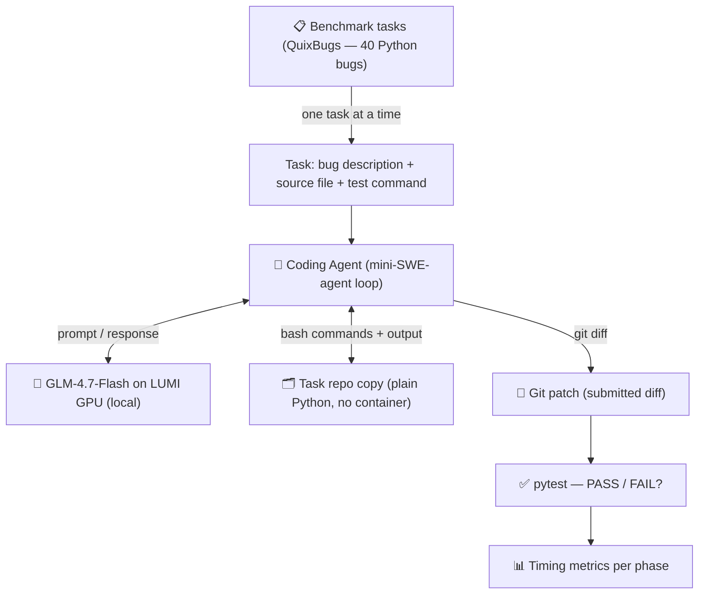
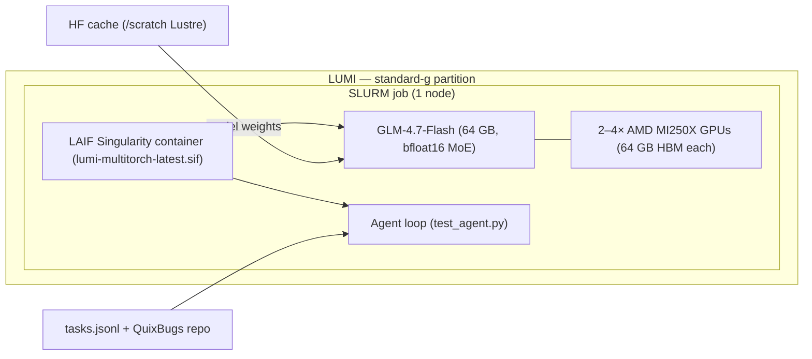

# Scaling AI Coding Agents on LUMI

**Course project report — Jens Stockmarr**
**Date: March 2026**

---

> ## Outstanding TODOs
> Search for `**TODO**` in this document to find all items. Summary:
>
> - [x] **Figure 1** — Phase time distribution pie chart (Section 6.2)
> - [x] **Figure 2** — Phase breakdown stacked bar chart per task (Section 6.3)
> - [x] **Figure 3** — Inference time vs step number scatter plot (Section 6.4)
> - [x] **Figure 4** — Configuration comparison bar chart (Section 6.7)
> - [ ] **Discussion** — Optional paragraph: what if ROCm grouped-GEMM were fixed? (Section 8)
> - [ ] **Conclusion** — 1–2 sentences on future directions (Section 9)
> - [ ] **Abstract** — Final polish pass once figures are done

---

## Abstract

This project investigates the practical feasibility of running interactive AI coding agents on
the LUMI supercomputer using a locally-hosted large language model. We implement a
mini-SWE-agent loop — an iterative bash-command-based agent — and measure the time
distribution across all pipeline phases (model load, task setup, LLM inference, command
execution, and testing) under different LUMI hardware configurations. Our primary finding
is that LLM inference completely dominates wall time (95–99%), and that adding more GPUs
does not improve inference throughput due to a ROCm kernel limitation in the MoE routing
path of the model. Horizontal parallelism (multiple independent jobs) proves far more
effective than vertical scaling (more GPUs per job) for maximising task throughput. Running
two simultaneous 2-GPU jobs completes all 40 benchmark tasks within the same wall-time
window that a single 4-GPU job cannot — at identical total GPU cost.

> **TODO (polish):** Re-read abstract once all figures are finalised — make sure the
> numbers cited here match the figures exactly.

---

## 1. Research Question

**Primary question:**
How does scaling AI coding agents on a supercomputer (LUMI) affect performance,
efficiency, and solution quality when evaluated using a standardised software engineering
benchmark?

**Sub-questions:**
- What does *scaling* mean in practice for AI coding agents (model size, GPU count, parallelism)?
- Which scaling axes provide meaningful throughput gains?
- What bottlenecks emerge when running an LLM-based agent loop on HPC infrastructure?

**Scope — what was studied:**
- Running a large language model locally on LUMI GPUs
- Measuring per-phase timing across the full agent pipeline
- Comparing single-job GPU configurations (2× vs 4× MI250X)
- Comparing sequential single-job vs parallel multi-job scheduling

**Out of scope:**
- Training or fine-tuning models
- Multi-agent sampling per task (running N agents per task, picking best)
- Human-in-the-loop evaluation

---

## 2. System Architecture

### 2.1 Pipeline overview

The overall pipeline takes a task description, runs an iterative agent loop with a local
LLM, and evaluates the result against a test suite.



### 2.2 Agent loop

Each task is solved through an iterative loop: the model proposes a bash command, it runs
in a copy of the task repository, and the output is fed back. This continues until the
model submits a patch or the step limit is reached.


Key design choices:
- The **model** is a black-box text generator loaded once per SLURM job
- The **agent** wraps prompts, parses responses, and executes shell commands
- **No containers** — QuixBugs runs as plain Python directly in the LAIF environment
- Correctness is determined purely by pytest outcomes — no human judgment

### 2.3 LUMI execution environment



---

## 3. Benchmark: QuixBugs

### 3.1 Why not SWE-bench?

The original plan was to use **SWE-bench Lite** (300 real GitHub bug-fix tasks). Two
fundamental blockers arose on LUMI:

**Nested Singularity:** The LAIF container (required for ROCm GPU access) runs
inside Singularity. SWE-bench tasks each require their own per-task Singularity container
for the Python environment. Running `singularity exec` from inside `singularity exec` is
not supported on LUMI — there is no straightforward workaround that preserves GPU access.

**Lustre setup overhead:** Extracting a full SWE-bench task sandbox from a SIF image to
the Lustre scratch filesystem takes approximately 1 hour per task — making a 40-task run
take 40+ hours of setup alone.

**Decision:** Switch to a benchmark that runs natively in the LAIF Python environment
without containers.

### 3.2 QuixBugs benchmark

[QuixBugs](https://github.com/jkoppel/QuixBugs) is a published benchmark of 40 classic
algorithm implementations, each containing a deliberate single-line bug.

| Property | Value |
|----------|-------|
| Tasks | 40 Python programs |
| Bug type | Single-line logic error per program |
| Evaluation | pytest — binary PASS/FAIL |
| Dependencies | Standard library only — no containers |
| Source | `python_programs/<name>.py` |
| Tests | `python_testcases/test_<name>.py` |

This makes QuixBugs ideal for measuring agent pipeline timing: it is a real, citable
benchmark with clean binary outcomes and zero container overhead.

---

## 4. Model: GLM-4.7-Flash on LUMI

**GLM-4.7-Flash** (ZhipuAI / zai-org) is a 32B Mixture-of-Experts (MoE) model. In
bfloat16 precision, the full weight set occupies ~64 GB — exactly matching a single
AMD MI250X GPU chip. This creates practical constraints on LUMI.

### 4.1 ROCm grouped-GEMM fix

With `transformers 5.3.0.dev0`, GLM-4.7-Flash uses the `glm4_moe_lite` architecture
which dispatches MoE expert routing through `torch._grouped_mm`. On LUMI's AMD MI250X
GPUs (ROCm), this function exists but is not implemented, causing:

```
RuntimeError: grouped gemm is not supported on ROCM
```

**Fix:** Patched `moe.py` in the myvenv to skip the fused kernel on ROCm:

```python
# Before:
elif hasattr(torch, "_grouped_mm"):

# After:
elif hasattr(torch, "_grouped_mm") and not getattr(torch.version, "hip", None):
```

This causes the code to fall through to `grouped_mm_fallback`, which iterates over expert
groups using standard `torch.mm`. Inference is functionally correct but slower than the
fused kernel would be.

### 4.2 OOM on single GPU

The 64 GB model fills an entire MI250X chip, leaving no room for the KV cache during
inference. Fix: `device_map="auto"` with `torch_dtype=torch.bfloat16`, requiring at least
2 GPUs (2× 64 GB = 128 GB total).

---

## 5. Experiment History

### Experiment 2 — One-shot diff generation (`lumi_glm_test_2`)

A simple proof-of-concept: feed a bug description and source file to GLM-4.7-Flash in a
single prompt and ask for a diff. Ran both via HuggingFace inference API and locally on
LUMI GPU.

- **Outcome:** Working pipeline; variable output quality. No test evaluation.
- **Key learning:** Local GPU inference on LUMI is feasible with correct module/container setup.

### Experiment 3 — Interactive agent, toy task (`lumi_glm_test_3`)

Introduced the iterative agent loop (mini-SWE-agent style) on a simple fibonacci bug-fix
task.

| Mode | Steps | Wall time | Model load |
|------|-------|-----------|------------|
| API (HF router) | 10 | 19s | — |
| Local GPU (LUMI) | 6 | 520s | 520s |

- **Key learning:** Model loaded as generic CausalLM (~12 GB) with old transformers —
  this was incorrect architecture. New transformers correctly loads the full 64 GB MoE.

### Experiment 4 — Real SWE-bench tasks (`lumi_glm_test_4`)

Ran the agent on real SWE-bench Lite tasks (astropy and django repos) using per-task
Singularity containers.

- **Outcome:** Pipeline working end-to-end. 1/2 evaluable tasks solved.
- **Key learning (ROCm crash):** Discovered `torch._grouped_mm` not supported on ROCm — patched the fallback.
- **Key learning (nested Singularity):** SWE-bench containers inside the LAIF container not supported on LUMI — fundamental blocker for local GPU mode on SWE-bench.
- **Key learning (API credits):** HF free tier exhausted after ~2.5 tasks at ~10s/step.

### Experiment 5 — Pipeline timing on QuixBugs (`lumi_glm_test_5`)

**Goal:** Measure the time distribution across all pipeline phases using a proper benchmark,
under different LUMI hardware configurations.

- Switched from SWE-bench to QuixBugs (no container overhead)
- Implemented per-phase timing instrumentation
- Ran three GPU configurations: 2GPU serial, 4GPU serial, 2×2GPU parallel

Full results in Section 6.

---

## 6. Results: Experiment 5

### 6.1 SLURM configurations tested

| Config | Jobs | GPUs/job | Tasks/job | Total GPU-h | Wall limit | Output dir |
|--------|------|----------|-----------|-------------|------------|------------|
| 2GPU serial | 1 | 2× MI250X | 40 | 16 | 8h | `runs_2gpu/` |
| 4GPU serial | 1 | 4× MI250X | 40 | 32 | 8h | `runs_4gpu/` |
| **2×2GPU parallel** | **2** | **2× MI250X** | **20 each** | **32** | **8h** | `runs_parallel_a/` + `runs_parallel_b/` |

The parallel configuration uses the same total GPU budget as 4GPU serial but splits the
workload across two simultaneously-scheduled jobs, each handling half the task list.

### 6.2 Phase timing — where does the time go?

All timings from jobs 16888661 (2GPU) and 16888703 (4GPU), 8h wall, 24–26 tasks completed.

| Phase | 2GPU | 4GPU | Notes |
|-------|------|------|-------|
| **Model load** | **2248s (37.5 min)** | **1182s (19.7 min)** | One-time per job |
| Setup — 1st task | ~27s | ~61s | Cold Lustre copy |
| Setup — subsequent | ~4s | ~5s | Warm cache |
| **Inference per step** | **~105–110s** | **~107–113s** | ROCm fallback |
| Exec per step | ~0.5s | ~0.5s | Local Python |
| Test (final pytest) | ~2s | ~2s | When not buggy |


### 6.3 Inference dominates

For every configuration tested, LLM inference accounts for **95–99% of task wall time**.
Setup, execution, and testing are negligible.


### 6.4 Context growth increases inference cost

Each agent step appends to the conversation history. The growing KV cache makes each
subsequent inference call slower:

| Steps in task | 2GPU avg inf/step | 4GPU avg inf/step |
|--------------|-------------------|-------------------|
| 2–3 | ~104s | ~106s |
| 4–7 | ~106–110s | ~108–113s |
| 9–12 | ~120–130s | ~124–134s |
| 13–14 | ~150–160s | ~150–180s |

A 14-step task pays approximately **50% more per step** than a 2-step task.


### 6.5 2GPU vs 4GPU vs 2×2GPU parallel — configuration comparison

| Metric | 2GPU serial | 4GPU serial | 2×2GPU parallel |
|--------|-------------|-------------|-----------------|
| Total GPU-hours | 16 | 32 | 32 |
| Model load | 37.5 min | 19.7 min | **4.2 min** ¹ |
| Tasks completed (8h) | 24/40 | 26/40 | **40/40** |
| PASS | 10/24 (42%) | 9/26 (35%) | **16/40 (40%)** |
| Avg inf/step (normal) | ~107s | ~110s | ~107s |

¹ The dramatically faster model load in the parallel jobs is likely due to the model weights
already being hot in the Lustre filesystem page cache from the two preceding jobs on the
same scratch path. This is a real effect but not guaranteed to be reproducible across
different nodes or after a long gap between jobs.

Adding 2 more GPUs provides **no inference speedup**. The ROCm `grouped_mm_fallback`
serialises MoE expert routing into sequential `torch.mm` calls regardless of how many
GPUs hold the weights. The only benefit of 4 GPUs is faster model loading.

### 6.6 Per-task results (2GPU serial, job 16888661)

| Task | Result | Steps | Wall (s) | Inf/step (s) |
|------|--------|-------|----------|--------------|
| bitcount | **PASS** | 4 | 474 | 104 |
| breadth_first_search | FAIL | 7 | 764 | 108 |
| bucketsort | **PASS** | 3 | 319 | 105 |
| depth_first_search | FAIL | 5 | 531 | 104 |
| detect_cycle | FAIL | 4 | 421 | 103 |
| find_first_in_sorted | FAIL | 2 | 239 | 103 |
| find_in_sorted | FAIL | 1 | **2201** | — ¹ |
| flatten | **PASS** | 4 | 435 | 106 |
| gcd | **PASS** | 6 | 668 | 110 |
| get_factors | FAIL | 8 | 965 | 119 |
| hanoi | FAIL | 3 | 324 | 106 |
| is_valid_parenthesization | **PASS** | 10 | 1217 | 121 |
| kheapsort | **PASS** | 7 | 763 | 108 |
| knapsack | FAIL | 14 | **2220** | 158 |
| kth | FAIL | 2 | 228 | 106 |
| lcs_length | FAIL | 4 | 422 | 105 |
| levenshtein | FAIL | 5 | **2025** | 403 ¹ |
| lis | FAIL | 4 | 431 | 106 |
| longest_common_subsequence | FAIL | 7 | **2209** | 315 ¹ |
| max_sublist_sum | **PASS** | 12 | 1524 | 126 |
| mergesort | **PASS** | 6 | **2273** | 376 ¹ |
| minimum_spanning_tree | FAIL | 2 | 217 | 105 |
| next_palindrome | **PASS** | 7 | **2069** | 294 ¹ |
| next_permutation | **PASS** | 10 | 1619 | 134 |

¹ Abnormally high: format error loop (model generating unparseable responses) or severe
context growth. These tasks consumed a disproportionate share of the 8h budget.

**10/24 PASS (42%)** on completed tasks. Job hit 8h wall limit at task 25/40.

### 6.7 Parallel 2×2GPU results

Two jobs submitted simultaneously (2026-03-21):
- **Job A (16914578):** tasks 1–20 (`tasks_a.jsonl`) → `runs/runs_parallel_a/`
- **Job B (16914579):** tasks 21–40 (`tasks_b.jsonl`) → `runs/runs_parallel_b/`

Both: 2× MI250X, 8h wall, `--task-timeout 1800` (30 min per-task cap).

**Both jobs completed all 20/20 assigned tasks** — the first complete 40-task run.

| | Job A (tasks 1–20) | Job B (tasks 21–40) | Combined |
|---|---|---|---|
| Tasks done | 20/20 | 20/20 | **40/40** |
| PASS | 9 (45%) | 7 (35%) | **16 (40%)** |
| Model load | 251s (4.2 min) | 251s (4.2 min) | — |
| Avg inf/step | ~107s | ~108s | ~107s |

#### Per-task results — Job A (tasks 1–20)

| Task | Result | Steps | Wall (s) | Inf/step (s) |
|------|--------|-------|----------|--------------|
| bitcount | **PASS** | 4 | 437 | 106 |
| breadth_first_search | **PASS** | 6 | 647 | 107 |
| bucketsort | **PASS** | 3 | 321 | 106 |
| depth_first_search | FAIL | 5 | 527 | 105 |
| detect_cycle | FAIL | 4 | 434 | 107 |
| find_first_in_sorted | FAIL | 2 | 243 | 106 |
| find_in_sorted | FAIL | 1 | **1997** | — ¹ |
| flatten | **PASS** | 4 | 433 | 107 |
| gcd | **PASS** | 4 | 437 | 108 |
| get_factors | FAIL | 13 | 1825 | 140 |
| hanoi | FAIL | 3 | 327 | 108 |
| is_valid_parenthesization | **PASS** | 10 | 1235 | 123 |
| kheapsort | **PASS** | 7 | 771 | 110 |
| knapsack | **PASS** | 13 | 1902 | 146 |
| kth | FAIL | 2 | 218 | 107 |
| lcs_length | FAIL | 4 | 434 | 108 |
| levenshtein | FAIL | 5 | **1932** | 385 ¹ |
| lis | FAIL | 4 | 433 | 107 |
| longest_common_subsequence | **PASS** | 13 | 1832 | 140 |
| max_sublist_sum | FAIL | 4 | **1814** | 452 ¹ |

#### Per-task results — Job B (tasks 21–40)

| Task | Result | Steps | Wall (s) | Inf/step (s) |
|------|--------|-------|----------|--------------|
| mergesort | **PASS** | 4 | 452 | 107 |
| minimum_spanning_tree | FAIL | 2 | 218 | 106 |
| next_palindrome | **PASS** | 9 | 1881 | 208 |
| next_permutation | FAIL | 4 | **1906** | 473 ¹ |
| pascal | FAIL | 1 | **1924** | — ¹ |
| possible_change | FAIL | 1 | **1804** | — ¹ |
| powerset | FAIL | 5 | 544 | 108 |
| quicksort | FAIL | 3 | **1851** | 615 ¹ |
| reverse_linked_list | FAIL | 1 | **1957** | — ¹ |
| rpn_eval | **PASS** | 8 | 877 | 109 |
| shortest_path_length | FAIL | 10 | 1848 | 184 |
| shortest_path_lengths | FAIL | 2 | 216 | 106 |
| shortest_paths | **PASS** | 5 | 541 | 107 |
| shunting_yard | FAIL | 7 | **1843** | 263 |
| sieve | FAIL | 6 | 646 | 107 |
| sqrt | FAIL | 11 | 1873 | 135 |
| subsequences | FAIL | 5 | **1917** | 382 ¹ |
| to_base | **PASS** | 5 | 542 | 108 |
| topological_ordering | **PASS** | 9 | 1108 | 122 |
| wrap | **PASS** | 5 | 553 | 110 |

¹ Abnormally high wall time or inf/step — format error loop or severe context explosion.
Tasks hitting ~1800s were cut by the per-task timeout.


---

## 7. Key Findings

### Finding 1: Inference dominates everything

LLM inference accounts for 95–99% of all task wall time. Setup, bash command execution,
and test running are collectively less than 5%. At this model scale (~100s/step), there is
no value in optimising any other phase.

### Finding 2: More GPUs ≠ faster inference (on ROCm)

The ROCm `grouped_mm_fallback` serialises MoE expert routing into sequential matrix
multiplications regardless of GPU count. This means:
- 4 GPUs offer identical inference throughput to 2 GPUs
- The only measurable benefit is 2× faster model loading
- For batch jobs (where model load is amortised over many tasks), 2 GPUs is the
  strictly more efficient allocation

### Finding 3: Horizontal parallelism beats vertical scaling

Splitting 40 tasks across two simultaneous 2-GPU jobs completes the full benchmark
within the 8h wall time (40/40 tasks), while a single 4-GPU job running all tasks
sequentially completed only 26/40 — at the same total GPU cost (32 GPU-hours). This
is the natural HPC scaling strategy: task-level parallelism over hardware-level
parallelism. It also uses half the per-node GPU allocation, leaving more headroom for
other users and reducing scheduling wait time.

### Finding 4: Context length is the real inference cost driver

Per-step inference time grows ~50% from step 2 to step 14. Managing context length
(fewer steps, history summarisation) would reduce cost more than any hardware change.

### Finding 5: Runaway tasks need explicit time budgets

A small number of tasks (format error loops, severe context explosion) consumed
disproportionate wall time. A per-task wall-time cap (implemented as `--task-timeout 1800`)
is essential for predictable batch throughput.

---

## 8. Discussion

### What worked well

- The end-to-end pipeline is robust and produces clean, reproducible timing data
- QuixBugs is an excellent benchmark for this purpose — real, citable, zero overhead
- The ROCm patch is simple and stable; no further inference crashes observed
- Per-phase instrumentation gives fine-grained data across all configurations

### What did not work as expected

- **SWE-bench on LUMI GPU** is not feasible without nested container support — a
  fundamental limitation of the current LUMI software stack
- **4 GPUs do not improve inference** — the ROCm fallback removes any benefit of
  tensor parallelism for this model's MoE routing
- **Format error loops** persisted for certain tasks despite the hard-reminder fix,
  suggesting the model has a stable failure mode on specific problem types

### Limitations

- QuixBugs is simpler than real-world bug-fix benchmarks — the 37–42% solve rate
  may not generalise to harder tasks
- Only one model (GLM-4.7-Flash) was tested — results are specific to this MoE
  architecture on ROCm
- The fast model load observed in the parallel jobs (4.2 min vs 37.5 min) is likely
  a Lustre cache warming effect from prior jobs, and may not be reproducible in cold
  conditions

> **TODO (discussion):** Consider adding a short paragraph on what the results would
> look like if the ROCm grouped-GEMM bottleneck were fixed — i.e., what inference speedup
> would be expected with 4 GPUs on a native CUDA system.

---

## 9. Conclusion

We successfully ran an interactive AI coding agent with a locally-hosted 32B MoE model
on LUMI, measured the full pipeline timing at per-phase granularity, and compared multiple
hardware configurations across 40 QuixBugs benchmark tasks. The dominant finding is that
LLM inference is the exclusive bottleneck (95–99% of wall time), and that on LUMI's AMD
MI250X GPUs with the current ROCm software stack, vertical scaling (more GPUs per job)
provides no inference throughput benefit due to the serialised MoE routing fallback.
Horizontal scaling (two parallel 2-GPU jobs) completed all 40 tasks within the same 8h
window that a single 4-GPU job could not — at identical total GPU cost — confirming that
task-level parallelism is the correct scaling strategy for this class of workload on LUMI.

> **TODO (conclusion):** Add 1–2 sentences on future directions — e.g., what would change
> if ROCm grouped-GEMM support were added, or if the benchmark were scaled to SWE-bench
> with a containerisation solution.

---

## Appendix: Files and Reproducibility

| File | Purpose |
|------|---------|
| `experiments/lumi_glm_test_5/test_agent.py` | Agent harness with per-phase timing |
| `experiments/lumi_glm_test_5/tasks.jsonl` | All 40 QuixBugs task definitions |
| `experiments/lumi_glm_test_5/tasks_a.jsonl` | Tasks 1–20 (parallel batch A) |
| `experiments/lumi_glm_test_5/tasks_b.jsonl` | Tasks 21–40 (parallel batch B) |
| `experiments/lumi_glm_test_5/run_agent_gpu.sh` | SLURM: 2GPU serial |
| `experiments/lumi_glm_test_5/run_agent_gpu4.sh` | SLURM: 4GPU serial |
| `experiments/lumi_glm_test_5/run_agent_gpu_a.sh` | SLURM: parallel batch A |
| `experiments/lumi_glm_test_5/run_agent_gpu_b.sh` | SLURM: parallel batch B |
| `experiments/lumi_glm_test_5/runs/` | All run outputs (metrics.json per task) |
| `report/data/` | Extracted timing data for figures |
| `docs/project.md` | Living project document |
| `report/lumi_lessons.md` | Lessons learned on LUMI |
