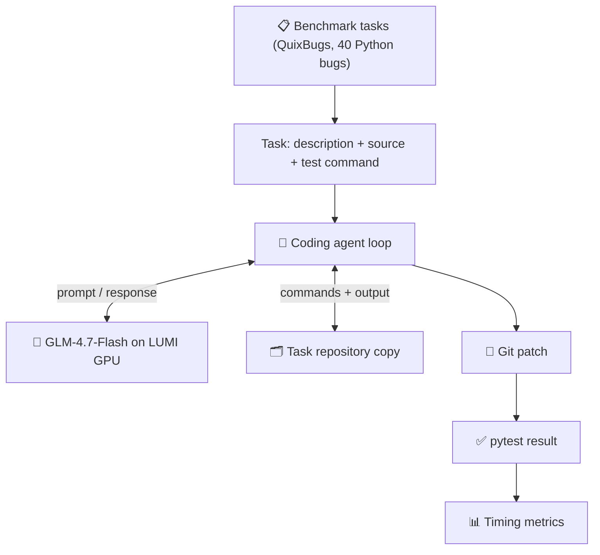
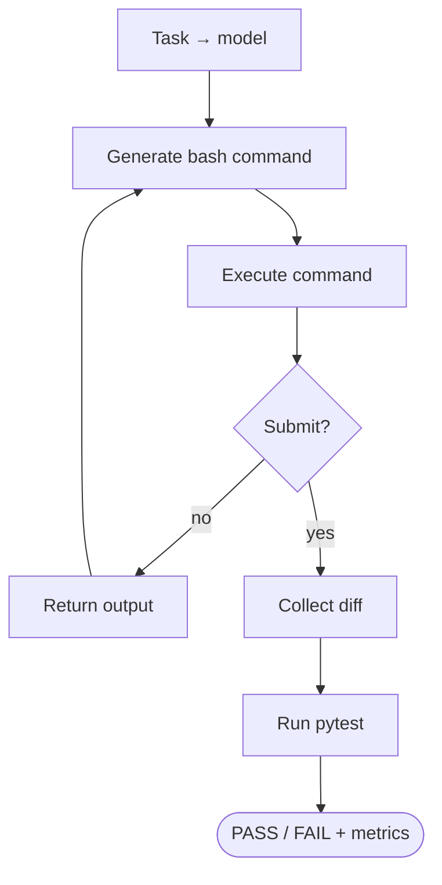
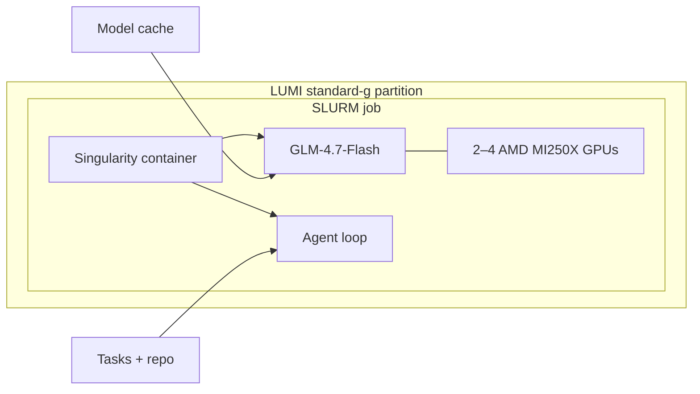
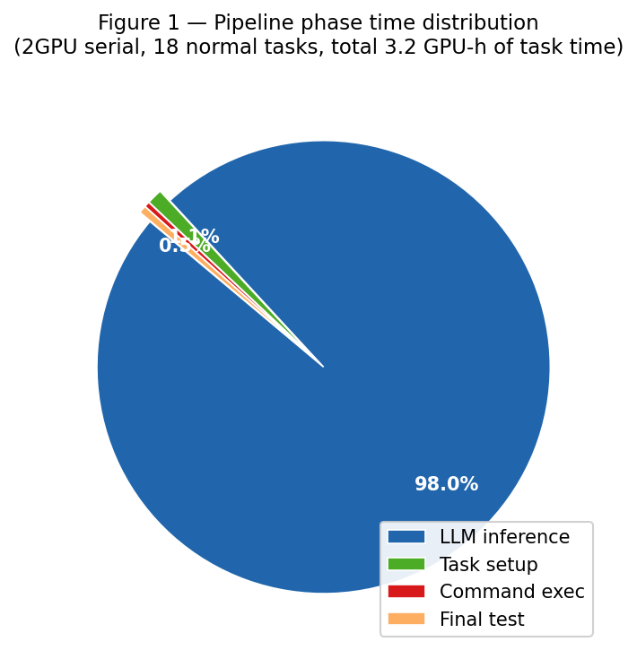
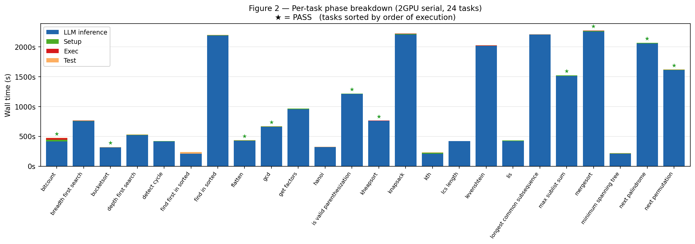
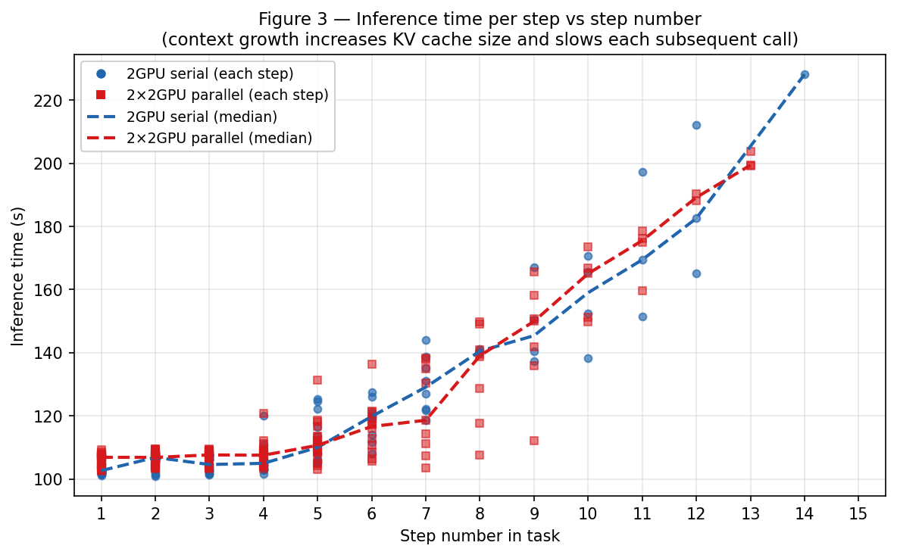
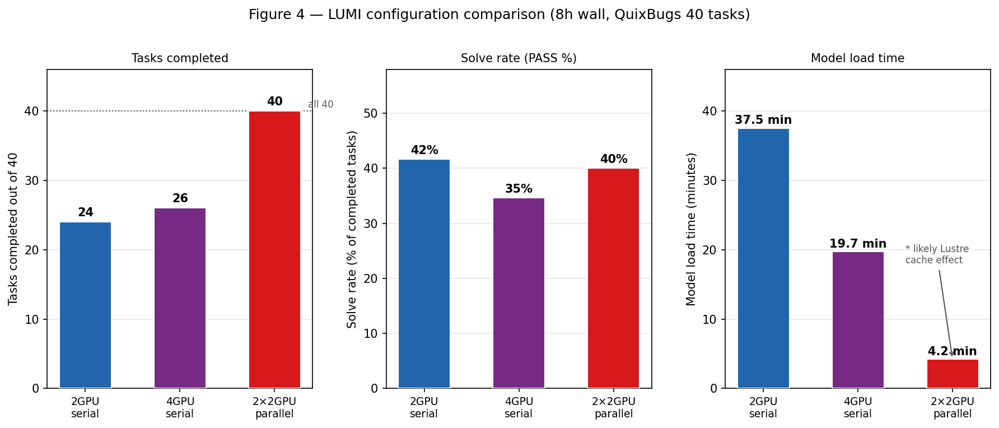

# Scaling AI Coding Agents on LUMI

**Course project report, Jens Stockmarr**
**Date: March 2026**

---

## Abstract

This project investigates the practical feasibility of running interactive AI coding agents on the LUMI supercomputer using a locally hosted large language model. A minimal agent loop was implemented in which the model iteratively generates bash commands to fix bugs, evaluated on QuixBugs, a published benchmark of 40 single-line Python algorithm bugs. The system records time spent in each pipeline phase: model loading, task setup, LLM inference, command execution, and testing.

The main result is that LLM inference dominates total runtime, accounting for 95 to 99 percent of wall time. Increasing GPU count from 2 to 4 does not improve inference speed due to a ROCm limitation in the mixture-of-experts routing path of the model. Running multiple jobs in parallel is far more effective: two parallel 2-GPU jobs complete all 40 tasks within the same 8-hour window that a single 4-GPU job cannot finish, at identical total GPU cost, with a 40 percent solve rate across the full benchmark.

---

## Project Timeline 

| Week | Work |
|------|------|
| Jan 27 | Project setup, first TA meeting, LUMI access |
| Feb 3 | TA meeting, mini-SWE-agent and SWE-bench running locally |
| Feb 10 | First GPU inference on LUMI (Experiment 1) |
| Feb 17 | SLURM setup, one-shot diff generation (Experiment 2) |
| Feb 23 | Interactive agent loop (Experiment 3) |
| Mar 9 | Agent on SWE-bench tasks, ROCm fix, container blocker (Experiment 4) |
| Mar 16 | Switched to QuixBugs, timing instrumentation, 2GPU and 4GPU runs (Experiment 5) |
| Mar 21 | Parallel jobs, first complete 40-task run |
| Mar 22 | Analysis, figures, report draft |
| Mar 26 | Report finalisation |

---

## 1. Research Question

**Primary question:**
How does scaling AI coding agents on LUMI affect performance, efficiency, and solution quality when evaluated on a standard software engineering benchmark?

**Sub-questions:**

* What does scaling mean for AI coding agents in practice? This includes model size, GPU count, and parallelism.
* Which scaling strategies actually improve throughput?
* What bottlenecks appear when running an LLM-based agent on HPC infrastructure?

**Scope:**

* Running a large language model locally on LUMI GPUs
* Measuring timing across all pipeline phases
* Comparing GPU configurations (2 vs 4 GPUs)
* Comparing sequential and parallel execution

**Out of scope:**

* Model training or fine-tuning
* Multiple agent sampling per task
* Human evaluation

### 1.1 Model choice: GLM-4.7-Flash

Open weights, downloadable and runnable locally without an API. Strong instruction-following
and structured output needed for the agent loop. Good code reasoning relative to inference
cost. Also available on the HuggingFace Inference API (free tier), which allowed early
experiments before GPU access was stable. Full technical details in §4.

### 1.2 Agent design: minimal custom loop

A hand-written single-file loop rather than an existing framework. Every prompt, response,
and timing measurement is explicit with no hidden retrying or state management. A single
Python file with no heavy dependencies is also much easier to run inside a Singularity
container on LUMI. The goal is to understand infrastructure scaling, not to maximise
pass rate.

---

## 2. System Architecture

### 2.1 Pipeline overview

The pipeline takes a task, runs an agent loop using a local LLM, and evaluates the result with tests.

### 2.2 Agent loop

Each task is solved iteratively. The model proposes a command, it runs, and the output is fed back until a patch is submitted or the step limit is reached.

**Design choices:**

* The model is treated as a black box and loaded once per job
* The agent handles prompts, parsing, and execution
* No containers are used for tasks
* Correctness is determined only by pytest

---

### 2.3 LUMI execution environment

---

## 3. Benchmark: QuixBugs

### 3.1 Why not SWE-bench

Two issues prevented using SWE-bench on LUMI:

* Nested containers are not supported
* Extracting task environments is extremely slow on Lustre

**Decision:** use a benchmark that runs directly in Python without containers.

### 3.2 QuixBugs

QuixBugs consists of 40 small Python programs, each containing a single bug.

| Property     | Value                   |
| ------------ | ----------------------- |
| Tasks        | 40                      |
| Bug type     | Single-line logic error |
| Evaluation   | pytest                  |
| Dependencies | Standard library        |

This makes it ideal for measuring pipeline timing.

---

## 4. Model: GLM-4.7-Flash

GLM-4.7-Flash is a 32B mixture-of-experts model. It requires about 64 GB in bfloat16 format, which matches one MI250X GPU.

### 4.1 ROCm limitation

ROCm does not support the grouped GEMM kernel used in the model. A small patch forces a fallback implementation. This keeps the model functional but slows inference.

### 4.2 Memory constraints

The model fills a single GPU, so at least two GPUs are needed to allow space for inference.

---

## 5. Experiment History

### Experiment 1: First GPU inference on LUMI

A minimal script loaded GLM-4.7-Flash and ran a simple coding prompt as a SLURM job.

* Confirmed the model runs on LUMI's AMD GPUs via the LAIF Singularity container
* Key learning: LUMI modules must be re-loaded in every session and every SLURM script; they do not persist across SSH logins or compute nodes

### Experiment 2: One-shot generation

Single prompt producing a diff.

* Worked, but inconsistent quality
* No evaluation step

### Experiment 3: Interactive agent

Introduced the loop on a simple task.

* API mode was fast
* Local GPU mode was slow due to incorrect model loading

### Experiment 4: SWE-bench

* Pipeline worked end-to-end on real tasks
* **ROCm crash:** GLM-4.7-Flash's MoE routing calls `torch._grouped_mm`, which exists on ROCm but is not implemented. Fixed with a one-line patch to skip the fused kernel and fall back to standard `torch.mm`.
* **Nested container blocker:** SWE-bench requires a per-task Singularity container for the Python environment, but LUMI does not support running `singularity exec` from inside another Singularity container. No workaround preserved both GPU access and task isolation, which is why the project switched to QuixBugs.

### Experiment 5: QuixBugs timing

* Switched to QuixBugs
* Added timing instrumentation
* Tested multiple GPU configurations

---

## 6. Results

### 6.1 Configurations

| Config           | Jobs | GPUs/job | Tasks   |
| ---------------- | ---- | -------- | ------- |
| 2 GPU serial     | 1    | 2        | 40      |
| 4 GPU serial     | 1    | 4        | 40      |
| 2×2 GPU parallel | 2    | 2        | 20 each |

---

### 6.2 Phase timing

| Phase | 2GPU | 4GPU |
|-------|------|------|
| Model load | 37.5 min | 19.7 min |
| Setup (1st task) | ~27s | ~61s |
| Setup (subsequent) | ~4s | ~5s |
| Inference per step | ~107s | ~110s |
| Command execution | ~0.5s | ~0.5s |
| Final pytest | ~2s | ~2s |

---

### 6.3 Key observation

Inference accounts for 95 to 99 percent of runtime.

---

### 6.4 Context growth

Later steps are slower because the prompt grows over time. A 14-step task can cost about 50 percent more per step than a short task.

---

### 6.5 Configuration comparison

| Metric | 2GPU serial | 4GPU serial | 2x2GPU parallel |
|--------|-------------|-------------|-----------------|
| Total GPU-hours | 16 | 32 | 32 |
| Model load | 37.5 min | 19.7 min | 4.2 min ¹ |
| Tasks completed (8h) | 24/40 | 26/40 | **40/40** |
| PASS rate | 10/24 (42%) | 9/26 (35%) | 16/40 (40%) |
| Avg inf/step | ~107s | ~110s | ~107s |

¹ Likely a Lustre page cache effect from preceding jobs on the same scratch path; not guaranteed to be reproducible.

Adding GPUs provides no inference speedup. The only measurable benefit of 4 GPUs is faster model loading, which is amortised to near-zero over a full 40-task run. Per-task results for all three configurations are in `report/data/`.

---

## 7. Key Findings

1. **Inference dominates runtime**
   LLM inference accounts for 95–99% of task wall time. Setup, execution, and testing combined are under 5%.

2. **More GPUs do not help**
   The ROCm fallback serialises MoE expert routing regardless of GPU count. 4 GPUs produce identical inference speed (~110s/step) to 2 GPUs (~107s/step). The only gain is 2x faster model loading.

3. **Parallelism is effective**
   Two parallel 2-GPU jobs completed all 40 tasks in 8 hours. A single 4-GPU job at the same total GPU cost completed only 26/40.

4. **Context length matters**
   Per-step inference time grows ~50% from step 2 to step 14 as the KV cache expands.

5. **Timeouts are necessary**
   A small number of tasks consumed 30+ minutes each due to format error loops. A per-task cap is essential for predictable batch throughput.

---

## 8. Discussion

### What worked

* Stable pipeline
* Clean timing data
* Suitable benchmark

### What did not work

* SWE-bench is not feasible on LUMI GPU
* Extra GPUs do not speed up inference
* Some tasks fail consistently

### Limitations

* Benchmark is relatively simple
* Only one model tested
* Cache effects may influence results

### What if the ROCm grouped-GEMM limitation were fixed?

The current bottleneck is that MoE expert routing falls back to a sequential loop on ROCm,
which removes any benefit from having more GPUs. On a CUDA system with a working fused
kernel, 4 GPUs would actually parallelize that routing step. Inference time would likely
drop by a factor of 2 or more per step, which would shift the optimal configuration: a
4-GPU job would then finish significantly faster than a 2-GPU one, and the trade-off
between vertical and horizontal scaling would look quite different. The conclusion that
parallelism beats vertical scaling is specific to the current ROCm fallback path, not a
general property of this class of workload.

---

## 9. Conclusion

This project demonstrates that AI coding agents can run on LUMI, but performance is dominated by inference time. Increasing GPU count does not improve speed under the current ROCm setup. The most effective scaling strategy is to run multiple smaller jobs in parallel. This approach maximises throughput while using the same total resources.

Two directions would be most valuable to pursue next. First, if ROCm grouped-GEMM support were added, vertical scaling would become meaningful and the 4-GPU configuration would provide real inference gains worth re-evaluating. Second, scaling to SWE-bench would require a solution to the nested container problem on LUMI, either through upstream support for Singularity-in-Singularity or by running the agent outside the LAIF container with a different GPU access method.

---

## Appendix

### A. Files and reproducibility

| File | Purpose |
|------|---------|
| `experiments/lumi_glm_test_5/test_agent.py` | Agent harness with per-phase timing |
| `experiments/lumi_glm_test_5/tasks.jsonl` | All 40 QuixBugs task definitions |
| `experiments/lumi_glm_test_5/tasks_a.jsonl` | Tasks 1-20 (parallel job A) |
| `experiments/lumi_glm_test_5/tasks_b.jsonl` | Tasks 21-40 (parallel job B) |
| `experiments/lumi_glm_test_5/run_agent_gpu.sh` | SLURM script: 2GPU serial |
| `experiments/lumi_glm_test_5/run_agent_gpu4.sh` | SLURM script: 4GPU serial |
| `experiments/lumi_glm_test_5/run_agent_gpu_a.sh` | SLURM script: parallel job A |
| `experiments/lumi_glm_test_5/run_agent_gpu_b.sh` | SLURM script: parallel job B |
| `experiments/lumi_glm_test_5/runs/` | All run outputs (metrics.json per task) |

### B. Per-task results

| File | Contents |
|------|----------|
| `report/data/results_2gpu.md` | 2GPU serial — 24 tasks, job 16888661 |
| `report/data/results_parallel_a.md` | 2x2GPU parallel job A — tasks 1-20, job 16914578 |
| `report/data/results_parallel_b.md` | 2x2GPU parallel job B — tasks 21-40, job 16914579 |

### C. LUMI lessons learned

See `report/lumi_lessons.md` for a full practical reference covering environment setup,
Lustre filesystem quirks, GPU/ROCm issues, the nested Singularity blocker, agent design
pitfalls, and scheduling tips.
